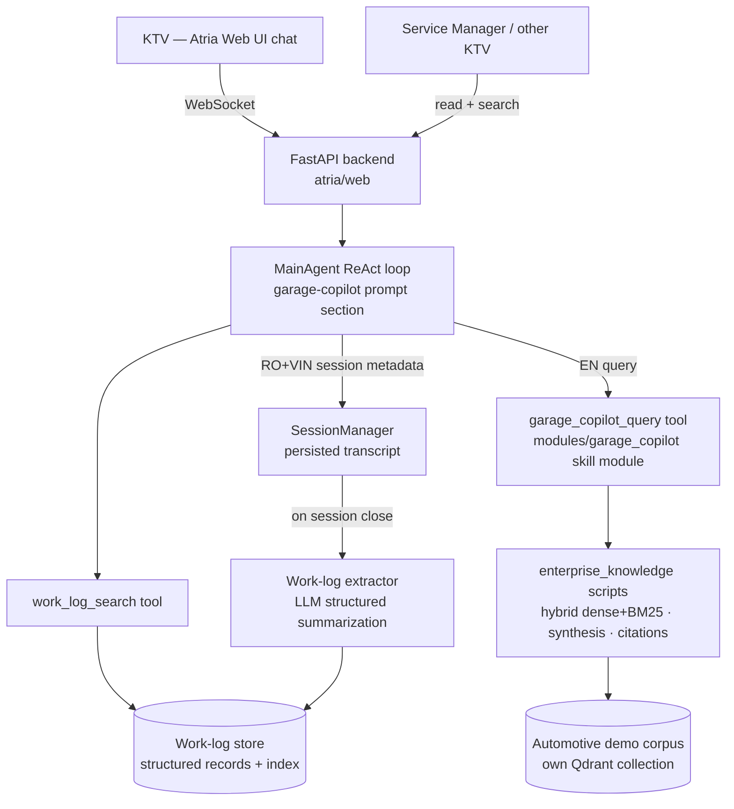

# System Design & Architecture

Feature: **garage-copilot**. Requirements: `docs/ai/requirements/2026-07-12-feature-garage-copilot.md`.

## Architecture Overview
**What is the high-level system structure?**

Key components:
- **Garage-copilot prompt section** (`templates/system/main/main-garage-copilot.md`, following the
  existing `main-*.md` naming convention, via PromptComposer conditioned on a garage-copilot
  session flag): defines the vibe-repairing persona, Vietnamese-first behavior, the
  RO-gate rule, citation/labeling discipline, and instructions to query tools in English. Prose
  only, no tables (repo rule). The LLM decides conversation flow each turn — no hard-coded
  branching (repo rule).
- **RAG tool** (`garage_copilot_query`): agent tool exposed by a new code-bearing skill module
  `modules/garage_copilot/` (SKILL.md `tools: agent_tools.py`, mirroring enterprise_knowledge's
  registration pattern), reusing `modules/enterprise_knowledge/scripts/` as a retrieval library
  with garage-specific settings — own corpus dir, own Qdrant collection, fixed open-access
  identity (no RBAC in v1). Returns cited passages/synthesis.
- **Work-log extractor**: on session close, one LLM call with a JSON-schema-constrained output
  produces the WorkLogRecord from the transcript; stored alongside the session.
- **Work-log search tool** (`work_log_search`): retrieval over stored WorkLogRecords (embedding
  index; falls back to keyword). Exposed both to the agent (third knowledge source) and to the web
  UI (human search).
- **Session anchoring**: web UI session-create form gains RO + VIN + brand fields stored in session
  metadata; the prompt section instructs refusal of repair work when metadata is absent.

Technology: existing Atria stack (Python/FastAPI/React/Zustand); no new services.

## Data Models
**What data do we need to manage?**

`WorkLogRecord` (stored per closed session; raw transcript remains in SessionManager):

- `session_id`, `ro_number`, `vin`, `brand`, `technician` (free-text name for v1)
- `symptom_reported` — verbatim, original language
- `hypotheses[]` — `{hypothesis, outcome: confirmed|rejected|untested, evidence}`
- `diagnostic_steps[]` — ordered `{step, result, citation?}`
- `root_cause`, `fix_applied`
- `parts_used[]`, `tools_used[]`
- `elapsed_time` (session duration), `status: complete|incomplete`
- `citations[]` — manual references used during the session
- `created_at`, `language` (narrative fields: Vietnamese with English technical terms verbatim —
  stakeholder decision 2026-07-12; `symptom_reported` always verbatim as spoken)

Storage: JSON files under the Atria app-data home (`ATRIA_DIR`, never committed — repo hygiene
rule), keyed by session ID, plus an embedding index for search. Extending Atria's existing
project-scoped session storage keeps one persistence pattern (decision D4).

## API Design
**How do components communicate?**

- Web UI → backend: existing WebSocket chat protocol; session-create payload extended with
  `{ro_number, vin, brand}`.
- Agent → tools (via tool registry):
  - `garage_copilot_query(question_en: str) -> {passages[], citations[], confidence}`
  - `work_log_search(query: str, vin?: str, brand?: str) -> WorkLogRecord summaries`
- Backend REST additions: `GET /api/worklogs/{session_id}` (structured log view),
  `GET /api/worklogs/search?q=` (human search). Auth: none beyond existing web UI (demo scope).

## Component Breakdown
**What are the major building blocks?**

- Frontend (web-ui/): session-create fields for RO/VIN/brand; work-log view panel; search page.
  Minimal styling — demo quality.
- Backend: prompt section markdown; two tool implementations + registry entries; work-log
  extractor invoked on session close; two REST endpoints.
- Corpus: automotive demo manuals ingested through the maintenance_copilot ingestion path.
- Third-party: none new.

## Design Decisions
**Why did we choose this approach?**

- **D1 — Build as an Atria mode, not a separate app**: reuses web UI, ReAct agent, session
  persistence, tool registry; the demo doubles as an Atria showcase. Alternative (standalone
  FastAPI app) rejected: duplicates infrastructure for no demo value.
- **D2 — RAG + labeled LLM fallback** (stakeholder decision): strict-RAG-only undersells the demo
  on a thin corpus; pure-LLM is unshippable for luxury brands. Labeling is enforced in the prompt
  section and verified by tests.
- **D3 — RO gate enforced in two layers (design review 2026-07-12)**: (a) the web session-create
  form requires non-empty `ro_number`/`vin`/`brand` before a garage session exists — form
  validation, not conversation branching, so the repo rule against hard-coded LLM flow is
  respected; (b) the prompt section instructs in-conversation refusals (e.g. the KTV asks about a
  different vehicle mid-session). Prompt-only enforcement was rejected as too soft for a rule the
  workshop treats as a serious violation.
- **D4 — Work log extracted at session close, not incrementally**: one schema-constrained
  extraction over the full transcript is simpler and produces more coherent hypothesis/dead-end
  narratives than per-turn accumulation. Trade-off: abandoned sessions need a sweep job / on-next-
  open trigger to produce `incomplete` logs.
- **D5 — VI→EN translation at query time by the agent**: the agent formulates English tool queries
  (instructed in prompt), keeping the pipeline unchanged. Alternative (translation layer inside the
  tool) deferred unless retrieval quality tests fail.
- **D6 (REVISED, implementation finding 2026-07-12) — Build `modules/garage_copilot/` as a
  code-bearing skill module reusing enterprise_knowledge's retrieval stack**: the originally
  planned maintenance_copilot pipeline was deleted from the repo (deprecated 3950a51, removed
  6889b8b; service moved to the cloud behind a RemoteConnector whose manifest is absent locally).
  Its in-repo transformation is `modules/enterprise_knowledge` — hybrid dense+BM25 over Qdrant,
  chunking, synthesis, guardrails, audit, and **cited Vietnamese answers** out of the box.
  garage_copilot reuses those scripts as a library (sys.path bootstrap) with its own corpus dir,
  own Qdrant collection, and a fixed open-access identity (garage v1 has no RBAC). Alternatives
  rejected: resurrecting the deleted pipeline from git history (team retired in-process tools.py;
  fights the codebase direction); ingesting garage content into enterprise_knowledge itself
  (corpus mixing, shared collection reset risk). Fallback if library reuse hits hard import
  coupling: copy a trimmed subset of the scripts into garage_copilot.
- **D7 — Source-label rendering convention (design review 2026-07-12)**: the prompt section
  enforces a fixed markdown convention — manual-grounded content carries inline citation refs from
  tool results (e.g. `[WSM §4.2, rev C]`); general-knowledge content is wrapped in a blockquote
  beginning `⚠ Gợi ý chưa kiểm chứng` ("unverified suggestion"). The web UI styles both patterns
  distinctly (light/dark). Chosen over structured message metadata to keep the WebSocket protocol
  untouched for the demo.
- **D8 — work_log_search reuses the same enterprise_knowledge embedding/index machinery (updated
  with D6 revision)**: one retrieval stack to operate and tune, same citation ergonomics; work
  logs get their own Qdrant collection. Alternative (separate lightweight index) rejected: second
  stack for no demo benefit.
- **D9 — Abandoned sessions swept on server startup (design review 2026-07-12)**: any garage
  session inactive with no close event gets an `incomplete` work log generated at next server
  start. No background scheduler in v1. Trade-off: a log may lag until restart — acceptable for
  the demo.

## Non-Functional Requirements
**How should the system perform?**

- Latency: tool-augmented answer < ~15 s per turn (demo tolerance); work-log extraction < 60 s.
- Safety: no uncited procedure presented as authoritative; labels rendered distinctly in UI.
- Privacy: customer names/VINs stay in local storage (ATRIA_DIR); no third-party messaging
  platforms (explicitly avoided Zalo for this reason).
- Reliability: RAG service unreachable → copilot reports the outage rather than silently falling
  back to uncited knowledge (mirrors existing maintenance_copilot rule).
- Scale: single-workshop demo; no multi-tenant or auth work in v1.

Future leverage noted during design review: the web backend already ships voice-transcription
infrastructure (`atria/web/transcribe_ws.py`) — the v2 voice modality has an existing integration
point and does not require new protocol work.
